# KraftMe Marketplace App

## Link to published site URL
[Visit the KraftMe application](https://young-scrubland-51531.herokuapp.com)

## Link to GitHub (public)
[Central GitHub Repository](https://github.com/EnFen/kraftme)
## Description of project,including,

### Problem definition / purpose
The purpose of KraftMe is to create a local artist market place - initially focussing on locations within  Australia -  where artists can display, buy and sell their works. 
Consumers will also be able to use the application to view work by local artists,  contact them and/or buy artworks they love,  all on the same platform. 

### Functionality / features
The application allows for the following:
  * User can make accounts and buy and sell artwork
  * User can upload images for artworks that they list on the site
  * User can see their purchase and sales history
  * User can send messages to the sellers of the artworks
  * Admin has a view that allows them to edit and destroy all artworks listed on site
  * Admin has view that allows them to see all transactions on site

## Screenshots
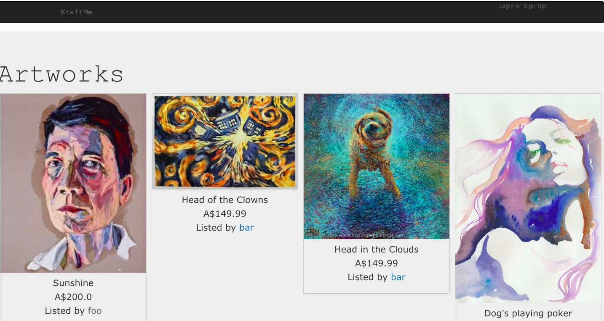
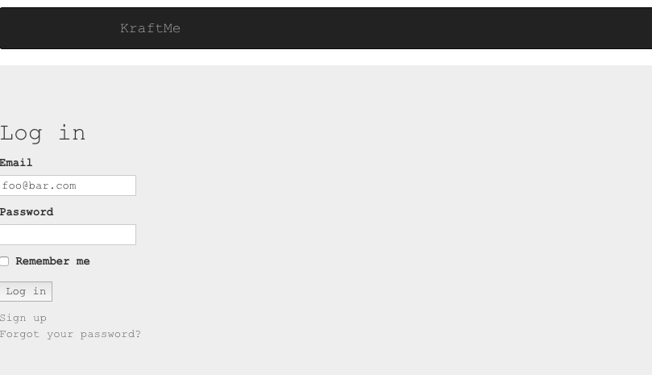
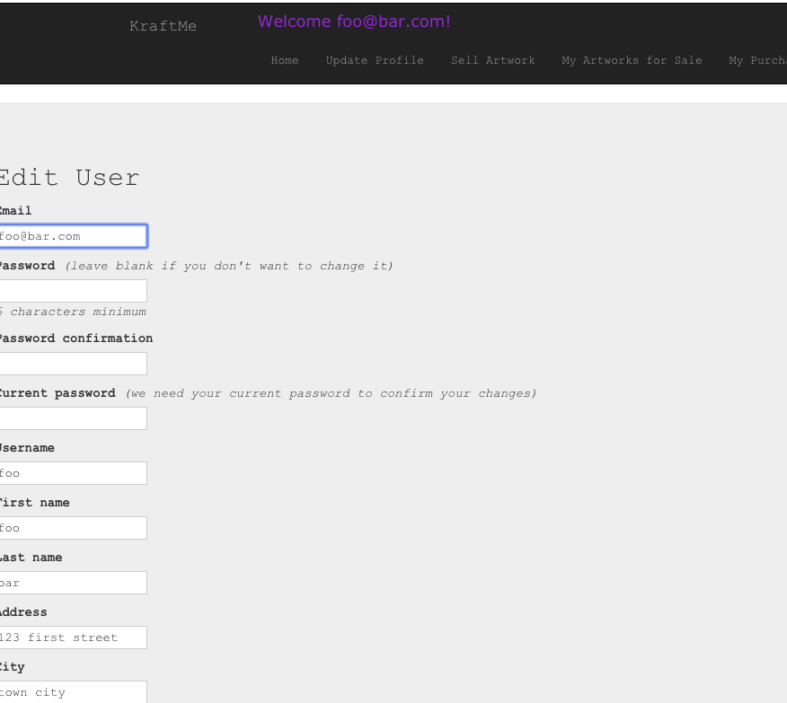
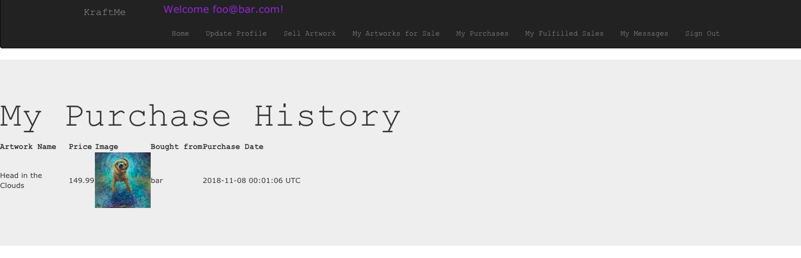
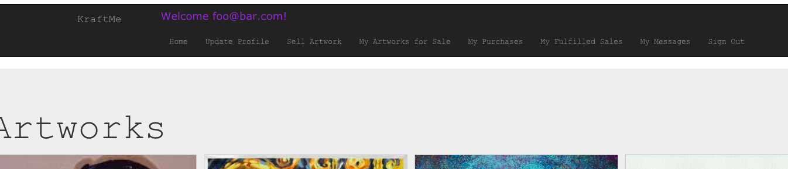
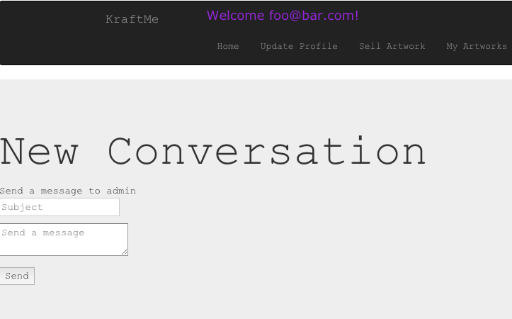
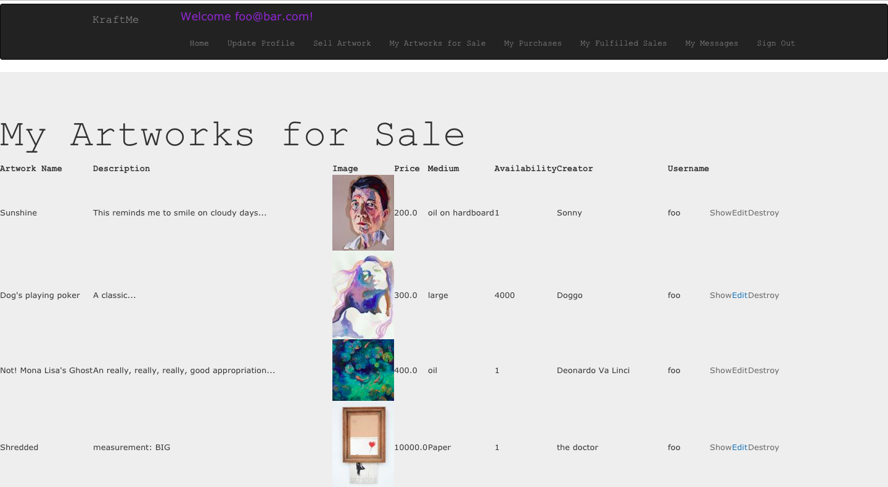
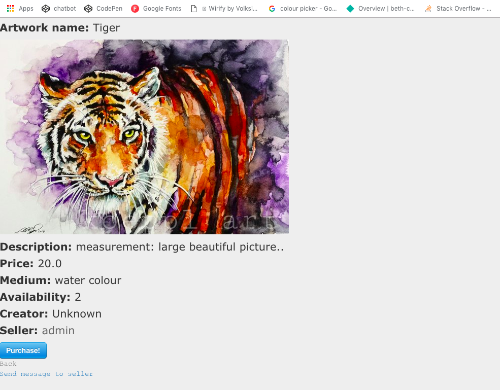
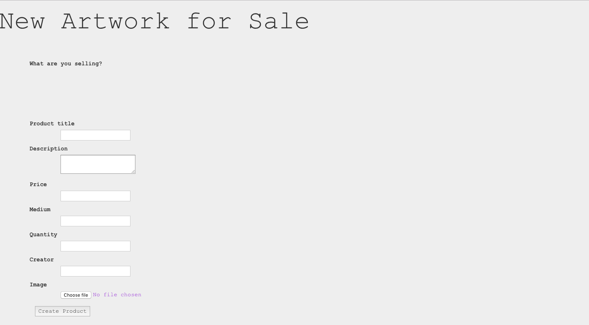
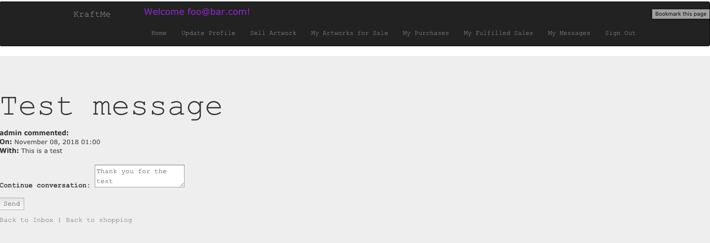

### Tech stack (e.g. html, css, deployment platform, etc)
The following technologies were used in the development and deployment of the KraftMe Marketplace App:
  * Ruby on Rails
  * HTML
  * CSS
  * Git/Github
  * Heroku

### Instructions on how to setup, configure and use your App.
A standard user of the site must first proceed to the [KraftMe Marketplace](https://young-scrubland-51531.herokuapp.com), whhere they will be able to view all available artworks in the KraftMe gallery. Once they have created a user profile and signed up, they will be able to access and participate in the rest of the website, including posting their own artworks for sale, contacting artists, or making a purchase.
At this time, admin level users must request access from the developers, who will set up the account and then provide the user with an appropriate admin level username and password.

## Design documentation

### Design process 
Our group started by brainstorming ideas for the marketplace, and decided to create an Australian only market place, where users can buy and sell their artworks. The application will be a place where people can find local artists, get in contact with them, buy artwork and also have the option to get their own masterpieces out to the public.  
Then we proceeded with doing the ERD, the user stories, and then started the development. We decided on the MVP features so we can prioritise them first and then identify nice-to-have features that we can work on given the timeline given for the assignment. Development was done via pair and solo programming.

### User stories
User stories were written on to cards on our Trello Board. Progress of our project over time, including how user stories were added, modified, and addressed in the project can be seen [here](./docs/trello_boards)

### A workflow diagram of the user journey/s.

### Wireframes

### Database Entity Relationship Diagrams

### Validation
See the process we used for validation rules [here](./docs/validation_rules)

## Details of planning process including:

### Project plan & timeline

### Screenshots of Trello board(s)

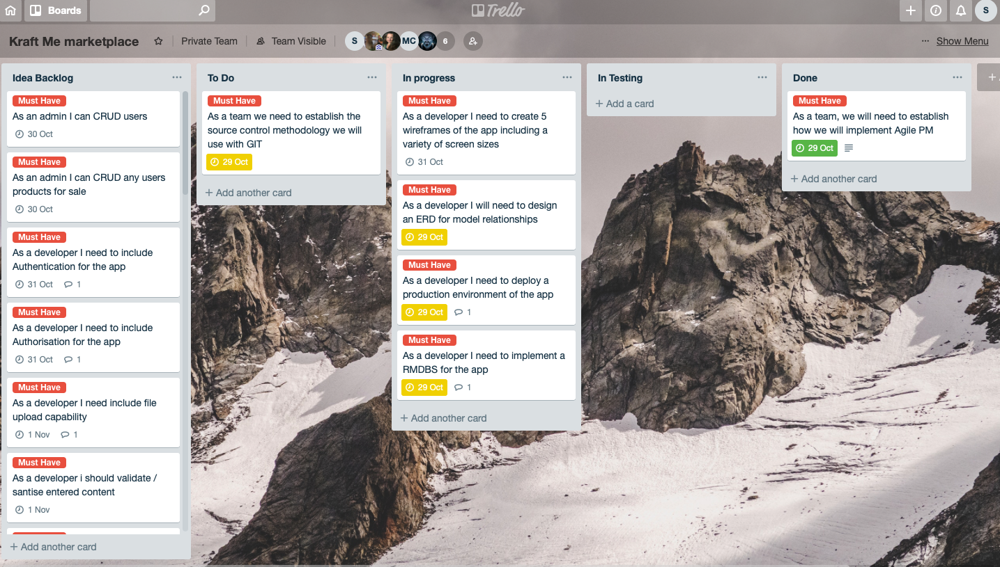
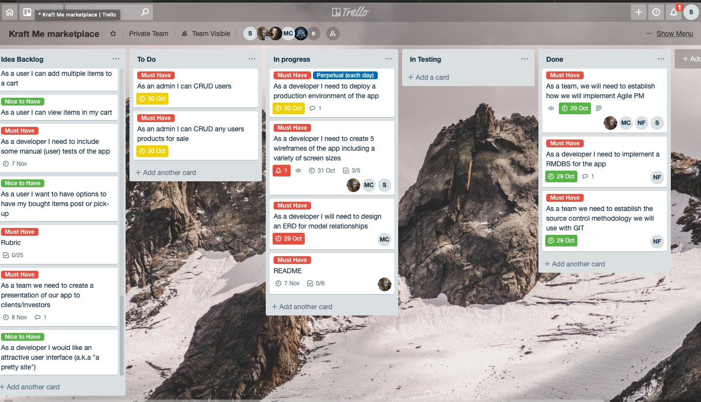
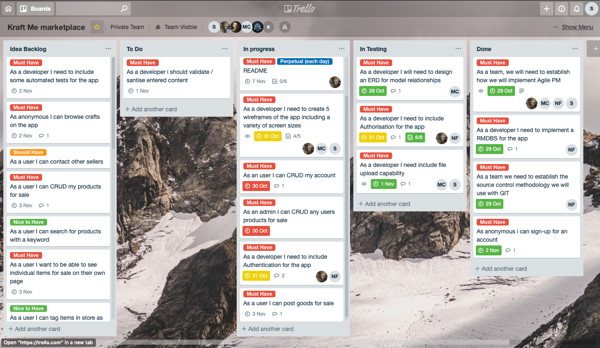
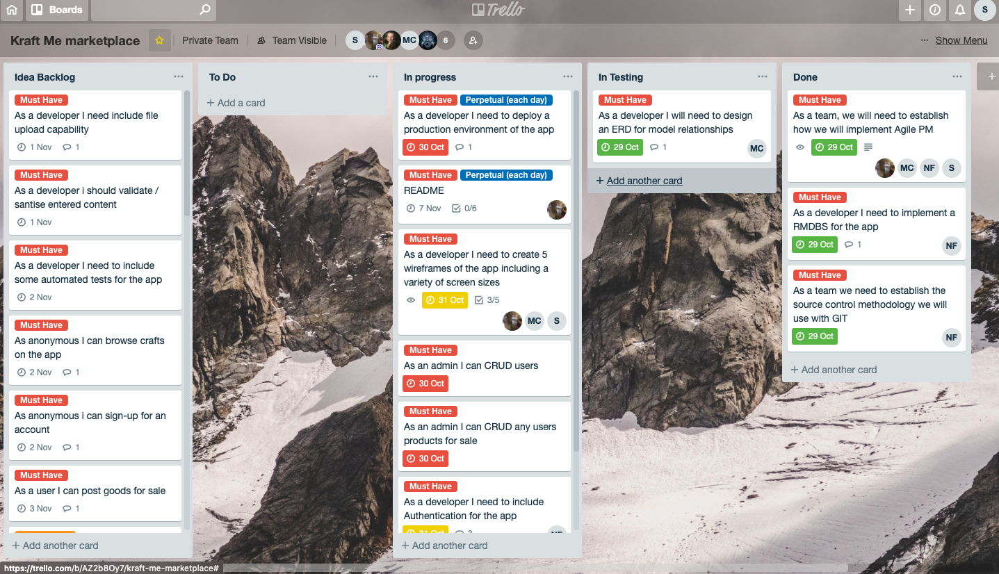
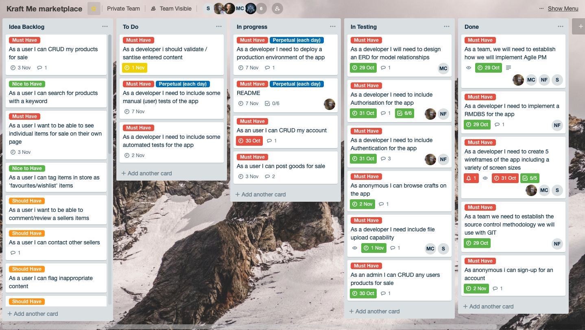
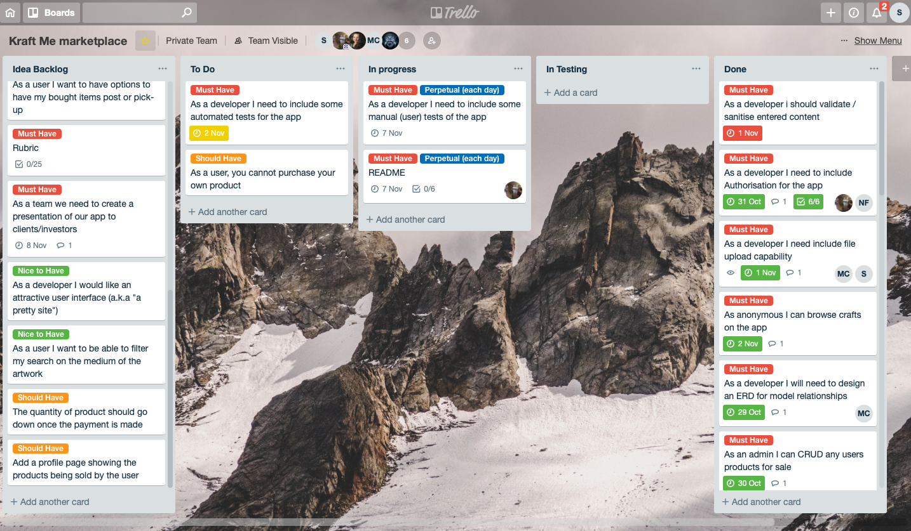
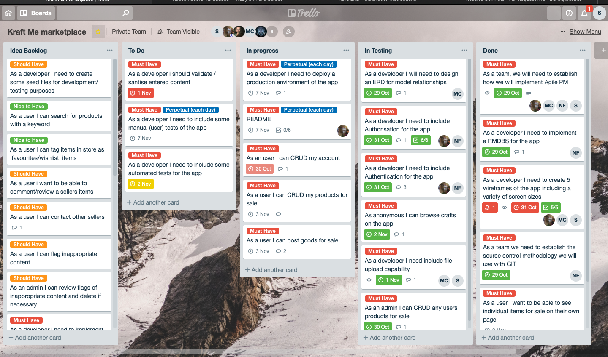

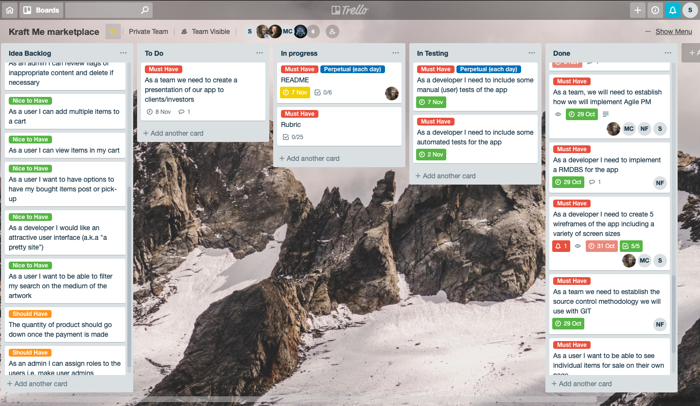

## Answers to the Short Answer questions (Section 2.2)

1. What is the need (i.e. challenge) that you will be addressing in your project?

2. Identify the problem you’re trying to solve by building this particular marketplace *App*? Why is it a problem that needs solving?

3. Describe the project will you be conducting and how. your *App* will address the needs.

4. Describe the network infrastructure the *App* may be based on.

5. Identify and describe the software to be used in your *App.*

6. Identify the database to be used in your *App* and provide a justification for your choice.

7. Identify and describe the production database setup (i.e. postgres instance).

8. Describe the architecture of your *App*.

9. Explain the different high-level components (abstractions) in your *App*.

10. Detail any third party services that your *App* will use.

11. Describe (in general terms) the data structure of marketplace apps that are similar to your own (e.g. eBay, Airbnb).

12. Discuss the database relations to be implemented.

13. Describe your project’s models in terms of the relationships (active record associations) they have with each other.

14. Provide your database schema design.

15. Provide User stories for your *App*.

16. Provide Wireframes for your *App*.

17. Describe the way tasks are allocated and tracked in your project.

18. Discuss how Agile methodology is being implemented in your project.

19. Provide an overview and description of your Source control process.

20. Provide an overview and description of your Testing process.

21. Discuss and analyse requirements related to information system security.

22. Discuss methods you will use to protect information and data.

23. Research what your legal obligations are in relation to handling user data.

