# README

# KraftMe Market App

## Link to published site URL

## Link to GitHub (public)

## Description of project

### Problem definition / purpose

### Functionality / features

## Screenshots
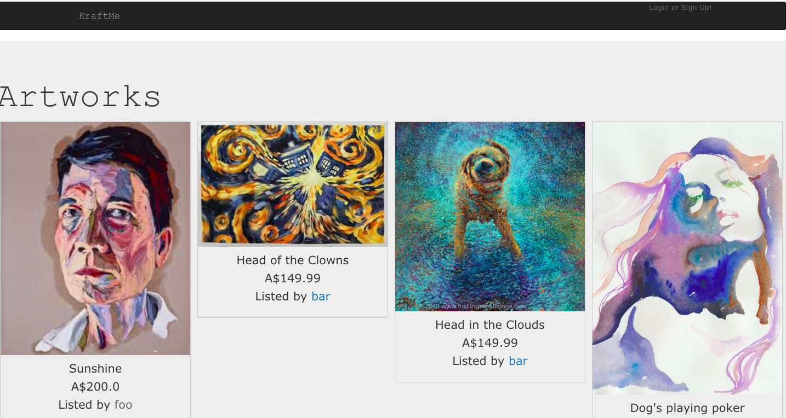
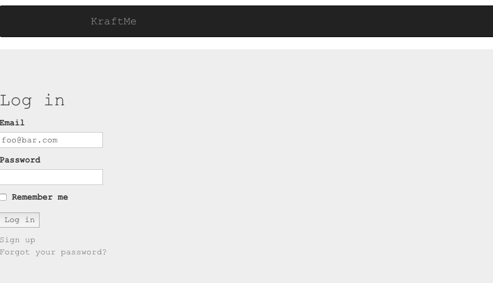
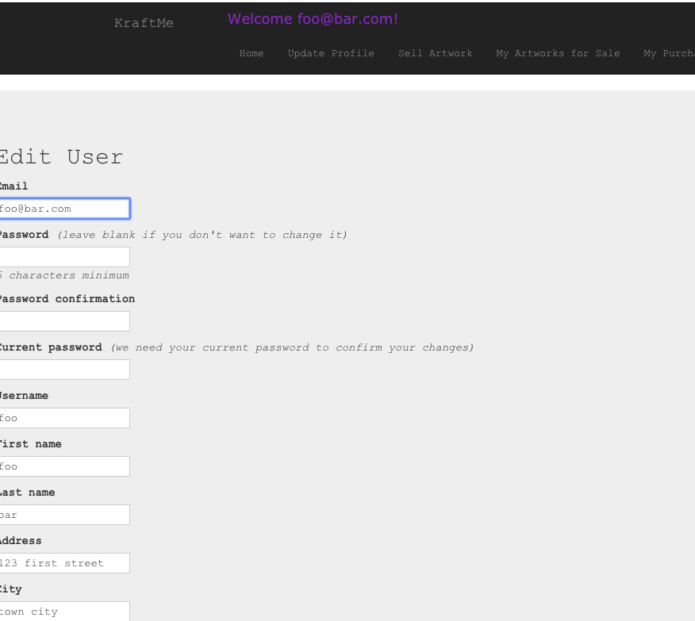
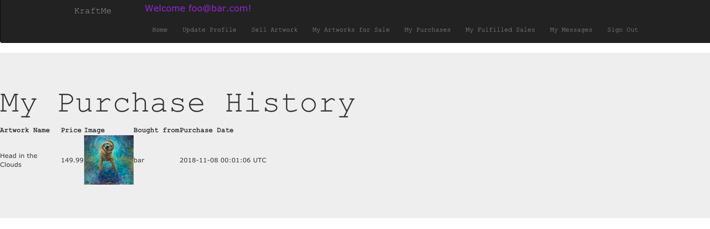
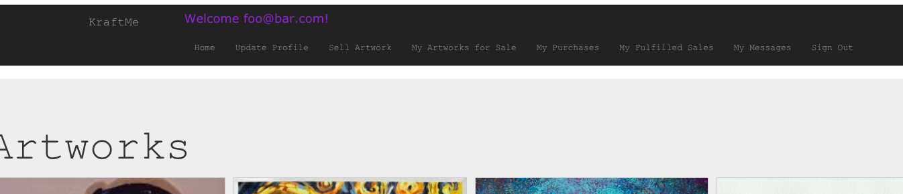
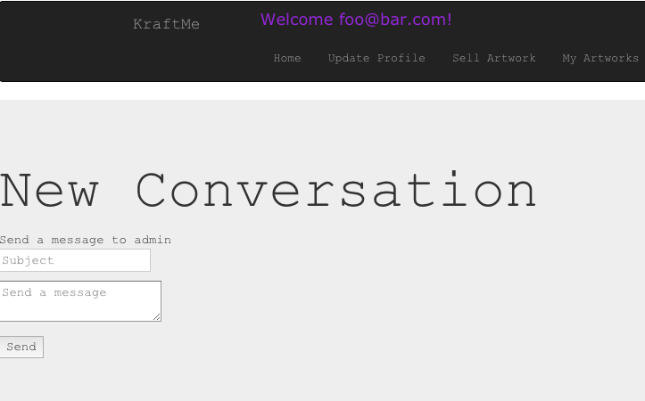
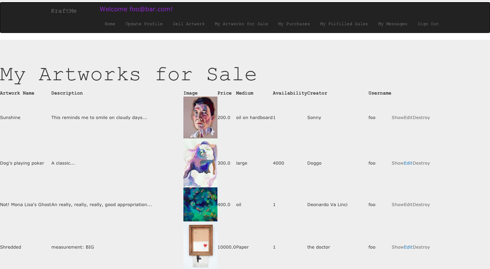
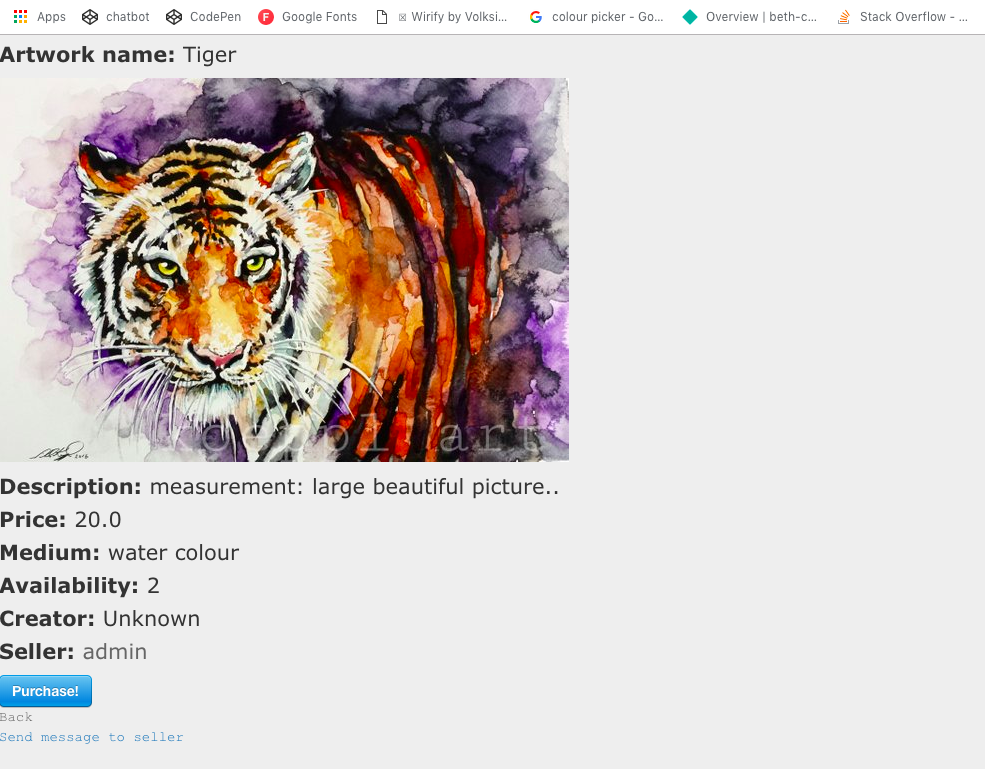
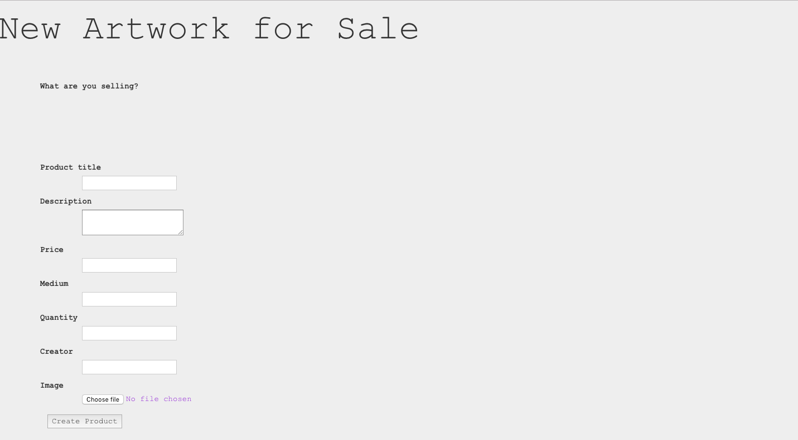
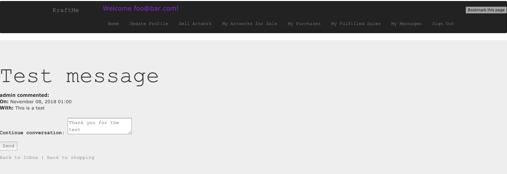

### Application

### Validation
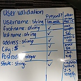

### Tech stack 
 

### Instructions on how to setup, configure and use your App.

## Design documentation

### Design process 

### User stories

### A workflow diagram of the user journey/s.

### Wireframes

### Database Entity Relationship Diagrams

## Details of planning process including:

### Project plan & timeline

### Screenshots of Trello board(s)

## Answers to the Short Answer questions (Section 2.2)

1. What is the need (i.e. challenge) that you will be addressing in your project?

2. Identify the problem you’re trying to solve by building this particular marketplace *App*? Why is it a problem that needs solving?

3. Describe the project will you be conducting and how. your *App* will address the needs.

4. Describe the network infrastructure the *App* may be based on.

5. Identify and describe the software to be used in your *App.*

6. Identify the database to be used in your *App* and provide a justification for your choice.

7. Identify and describe the production database setup (i.e. postgres instance).

8. Describe the architecture of your *App*.

9. Explain the different high-level components (abstractions) in your *App*.

10. Detail any third party services that your *App* will use.

11. Describe (in general terms) the data structure of marketplace apps that are similar to your own (e.g. eBay, Airbnb).

12. Discuss the database relations to be implemented.

13. Describe your project’s models in terms of the relationships (active record associations) they have with each other.

14. Provide your database schema design.

15. Provide User stories for your *App*.

16. Provide Wireframes for your *App*.

17. Describe the way tasks are allocated and tracked in your project.

18. Discuss how Agile methodology is being implemented in your project.

19. Provide an overview and description of your Source control process.

20. Provide an overview and description of your Testing process.

21. Discuss and analyse requirements related to information system security.

22. Discuss methods you will use to protect information and data.

23. Research what your legal obligations are in relation to handling user data.

